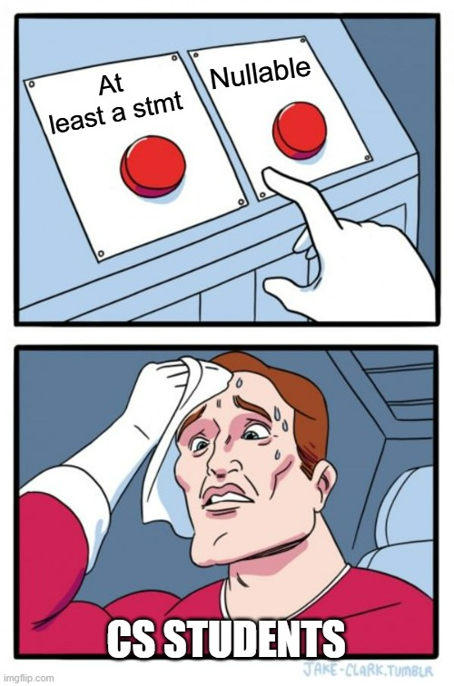

<h3>This is one of the hardest courses I studied at HCMUT</h3>
<h1>Principle of Programming Language</h1>

<h3>Assignment 1</h3>
<b>Grade: Lexer (100/100), Parser(98/100)</b>
Well, this is not a hard assignment, study this makes me feel of becoming a Linguistics student, not Computer Science :D
There are 2 parts in this assignment.

<b>Lexer</b>: Well, to be honest, this is just like a list of initializations, we have to define keywords, separators, literals, ... Not hard, however, when asking Dr Phung on 4rum, I love the way he replied forum, so at this part, there are some trickies:
<ul>
    <li>Int Literals: well, there are 4 types of IntLit in this assignment, so be careful.</li>
    <li>String Literals: Unlike Mr Duy, String of Dr Phung include 2 quotes so this is a legal string lit: "Hello" not Hello.</li>
    <li>Automated Semicolon: well, this is trickiest part of Lexer, we have to program in the Lexer class to define it, however, you can do it yourself, be confident.</li>
</ul>
<b>Parser</b>: Well, after a list of initialization, we have to do the grammar, this part is not hard, however, the ways Dr Phung replied 4rum made it harder, this was a war of 2 teams: "Nullable Block" and "At least a statement Block". 

<ul>
    <li>Literals and Expressions: this part not hard, however you have to becareful in array literals, you can split it into many parsers, it can help you to easily handle the problem</li>
    <li>Declarations: This part is very easy, but try to split into many parsers, do not do in one line. It makes your code clean and easier to debug</li>
    <li>Statements: Well, nothing to say, it likes Declarations, but remember that, the program is list of declarations, <b>NOT</b> list of statement</li>
</ul>
Well, I will write sample of parser here for you easily imagine. Assumes that, all uppercases are Lexer and lowercases are parsers. this is just sample, not relevant to this assignment, maybe this is Python: 

<code>
    if_full_stmt: if_stmt elif_stmt? else_stmt? ;
    if_stmt: IF expression COLON list_stmt ;
    elif_stmt: ELIF expression COLON list_stmt ;
    else_stmt: ELSE list_stmt ;
</code>

<h3>Assignment 2</h3>
<h3>Assignment 3</h3>
<h3>Assignment 4</h3>
